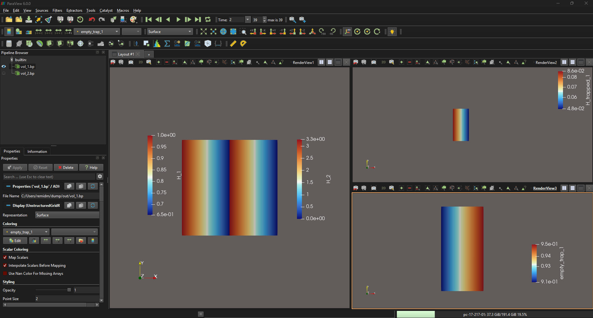

# FESTIM GUI Design Document

## 1. Introduction

### 1.1 Purpose of This Document

This document serves as the guiding reference for the collaborative development of a graphical user interface (GUI) for **FESTIM** (Finite Element Simulation of Tritium In Materials), an open-source hydrogen transport code. It is intended to align Kitware and the FESTIM development team on project philosophy, scope, technical constraints, and deliverables.

### 1.2 Parties

- **FESTIM Team:** Remi Delaporte-Mathurin & James Dark, MIT PSFC
- **Kitware:** Sebastien Jourdain

### 1.3 Timeline & Milestones

| Milestone | Target Date | Description |
|---|---|---|
| Kickoff | mid-late April | Alignment on this document |
| Prototype / MVP | TBD | Minimal working GUI that can set up and run a simple FESTIM simulation |
| Community demo | TBD | Present MVP to FESTIM community for feedback |
| Feature-complete v1 | TBD | All Phase 1 features implemented |
| Release | TBD | Public release |

---

## 2. Project Philosophy

### 2.1 Guiding Principles

1. **Lower the barrier to entry.** The primary motivation is to make FESTIM accessible to users who are not comfortable writing Python scripts — experimentalists, students new to simulation, curious newcomers, and collaborators from adjacent fields.

2. **The GUI is a frontend companion, not a fork.** The GUI generates valid FESTIM Python scripts and can execute them. It must not duplicate or re-implement FESTIM's solver logic. FESTIM remains the source of truth.

3. **Don't chase the 100% flexibility dream.** The GUI is an abstraction layer. It will be almost impossible to make (and maintain) a GUI that is able to do everything and anything. If an advanced user wants a very niche use case, then the GUI is not the right place for it and they should use the python API. Refer to Guiding Principle #1 above.

4. **Open source.** The GUI is released under the **MIT License**, consistent with FESTIM itself. All development happens on GitHub.

5. **Don't constrain power users.** The GUI should expose the most common workflows visually, but always allow users to inspect, edit, and **download** the generated Python script. Advanced users should never feel locked in.

6. **Sustainability.** The tool should be maintainable by the FESTIM community after the collaboration ends. This means clean architecture, good documentation, and minimal exotic dependencies.

---

## 3. About FESTIM

### 3.1 What FESTIM Does

FESTIM solves hydrogen (H, D, T) transport equations in materials, accounting for:

- Diffusion (with temperature-dependent diffusivity)
- Trapping/detrapping at material defects
- Surface processes (recombination, dissociation, Sievert's law, etc.)
- Chemical reactions
- Multi-material domains
- Transient and steady-state simulations
- 1D, 2D, and 3D geometries (via FEniCSx)

### 3.2 Key Links & Resources

| Resource | URL |
|---|---|
| FESTIM GitHub repository | <https://github.com/festim-dev/FESTIM> |
| FESTIM documentation | <https://festim.readthedocs.io> |
| FESTIM tutorials/examples | <https://festim-workshop.readthedocs.io/> |
| FEniCSx (backend solver) | <https://fenicsproject.org> |
| FESTIM Slack workspace | [invite link](https://join.slack.com/t/festim-dev/shared_invite/zt-246hw8d6o-htWASLsbdosUo_2nRKCf9g) |
| Trame documentation | <https://trame.readthedocs.io> |
| Published paper | https://doi.org/10.1016/j.ijhydene.2026.153987 |

### 3.3 Technical Stack

- **Language:** Python
- **PDE backend:** FEniCSx (DOLFINx)
- **Meshing:** Built-in FESTIM for 1D; DOLFINx built-in meshes for simple 2D/3D; GMSH for complex geometries (eg. CAD based)
- **Post-processing:** Typically done with matplotlib/plotly, ParaView, or pyvista

---

## 4. Objectives of the GUI

### 4.1 Primary Objectives

1. Be a demo, a hook, for people to try out FESTIM with zero friction
1. Allow users to **parametrise a FESTIM simulation** entirely through a graphical interface (geometry, mesh, species, boundary conditions, sources, temperature, solver settings, exports).
2. **Generate a valid FESTIM Python script** that the user can run, inspect, download, and modify.
3. **Run the simulation** from within the GUI.
4. **Visualise results** — both spatial fields and derived quantities.

### 4.2 Secondary / Stretch Objectives

- Visual mesh preview
- Template library with pre-built setups for common experiments (1D, 2D, and 3D examples)
- Import experimental tabular data for overlay on simulation results

### 4.3 Non-Objectives (Out of Scope)

- Reimplementing FESTIM's solver
- Supporting non-FESTIM simulation codes
- CAD modeling
- GMSH integration within the GUI (users prepare meshes externally and upload)
- Material property database integration
- Parameter sweeps / batch runs (longer-term feature to keep in mind for future development)

---

## 5. Architecture

### 5.1 High-Level Pipeline

The GUI follows a four-stage pipeline:

**User Interface** (Parametrise) → **Python Code** (FESTIM script) → **Runner** (Execute) → **Visualiser** (Plot results)

From the **Python Code** stage, the user can **download** the generated `.py` script at any time for independent use outside the GUI.

The **Runner** produces two types of outputs:

| Result Type | Description | File Format | Visualisation |
|---|---|---|---|
| **Fields** | Spatial fields over time (e.g. concentration). Defined over the full mesh. | `.bp` (VTX/ADIOS2) | 2D/3D field plots, colormaps, time slider |
| **Derived Quantities** | Scalar quantities computed over subdomains (volumes or surfaces) from the solution. Examples: `SurfaceFlux`, `AverageVolume`, `TotalVolume`, `AverageSurface`, etc. Tabular data as a function of time. | `.csv` | Line plots (t vs. Y) |

The user configures which exports they want as part of the simulation setup (Stage 1).

**Stage 1 — User Interface (Parametrise):**
The user defines all simulation parameters through GUI forms and widgets. No FESTIM knowledge required.

**Stage 2 — Python Code Generation:**
The GUI translates the user's inputs into a valid, standalone FESTIM Python script. The user can **preview** the script at any time and **download** it for independent use outside the GUI.

**Stage 3 — Runner:**
The generated script is executed. The runner manages simulation execution and streams progress/status back to the GUI.

**Stage 4 — Visualiser:**
Once the simulation completes, results are loaded and displayed within the GUI. Fields (`.bp`) are shown as spatial plots with a time slider. Derived quantities (`.csv`) are shown as line plots of t vs. Y.

### 5.2 Framework: Trame

The GUI is built with [**Trame**](https://trame.readthedocs.io), Kitware's Python framework for building interactive applications. Trame natively supports VTK/ParaView integration and enables both deployment modes:

| Deployment Mode | Description | Use Case |
|---|---|---|
| **Local desktop** | User installs via conda and runs locally | Users with FEniCSx installed, power users, offline use |
| **Hosted web app** | Deployed on a server, accessed via browser | Demos, workshops, users without local FEniCSx install, onboarding |

Both modes use the same codebase. The Trame architecture ensures a single implementation serves both.

### 5.3 FESTIM Version Strategy

For the scope of this collaboration with Kitware, the GUI will be developed against a **specific agreed-upon version of FESTIM** (e.g. `festim==X.Y.Z`). This ensures a stable target for development and testing.

For longer-term maintenance beyond this project, the GUI will adopt a **version pinning strategy**: each GUI release will declare compatibility with a specific FESTIM release. When FESTIM publishes a new version, the GUI will be updated and tested before bumping the pin.

### 5.4 FEniCSx Environment

FEniCSx can be non-trivial to install. The GUI should work within:

- A **conda environment** with FEniCSx installed (primary target for local use)
- A **Docker container** (for hosted deployment and users who prefer containers)

---

## 6. Target Users & Workflows

### 6.1 User Personas

**The Curious** — Heard about FESTIM, wants to try it without committing to learning the Python API. Needs a zero-friction first experience and an impressive out-of-the-box demo. GUI goal: **convert this person into a FESTIM user.**

**The Experimentalist** — Runs TDS or permeation experiments, wants to fit simulation to data. Needs simple setup and result visualisation. GUI goal: enable simulation-informed experimental analysis.

**The New Student** — Just joined a research group, learning hydrogen transport. Needs a guided workflow, good defaults, and educational feedback. GUI goal: accelerate onboarding.

**The Collaborator** — Not a FESTIM expert, receives a shared simulation file. Needs to open, run, and visualise with minimal friction. GUI goal: frictionless sharing of simulation setups.

> **Note:** The power user who is already proficient with the FESTIM Python API is not the primary target of this tool. They will likely continue using the API directly. However, the GUI should not prevent power users from benefiting (e.g. via script download or rapid prototyping).

### 6.2 Core Workflow

1. Define geometry (volume and surface subdomains) & mesh
2. Define species
3. Define boundary conditions (Dirichlet, Flux, ...)
4. Define particle sources (optional)
5. Define chemical reactions (optional)
6. Define temperature (function of space and time — no heat transfer solver)
7. Define settings (transient/steady-state, final time, tolerances, step size, ...)
8. Define exports (select fields and/or derived quantities)
9. Preview / validate setup
10. Preview Python script — and/or — download `.py` file
11. Run simulation
12. Visualise results

---

## 7. Minimal Working Example

The MVP should be able to reproduce this canonical case end-to-end through the GUI.

### 7.1 2D Permeation Through a Membrane

See [the example FESTIM script](festim_example/2d_permeation.py)

**Physics:**

- 2D rectangular domain
- DOLFINx built-in rectangle mesh with user-defined `nx`, `ny`, and cell type (triangle or quadrilateral)
- Temperature defined as a function of space and time or a float (e.g. uniform 500 K)
- Boundary conditions:
    - Left boundary: Recombination and Dissociation flux
    - Top boundary: Recombination flux or Dirichlet = 0
    - Bottom and right boundaries: no flux
- One mobile species (diffusion), one trapped species (immobile, doesn't diffuse) + implicit species for "empty traps"
- Transient solve
- Exports:
    - concentration field(s) as VTX files
    - Mobile particle flux at the left and top boundaries
    - Integral of concentrations in the volume

**Example paraview viz**

The user would typically open the `.bp` files in paraview to visualise the different concentration fields (transient!).

**Expected GUI actions:**

1. User defines a rectangular 2D geometry with dimensions
1. User sets mesh parameters: `nx`, `ny`, cell type (triangle / quadrilateral)
1. User defines materials with right properties (D₀, E_D)
1. User defines volume (and assign materials) and surface subdomains
1. User defines the species (mobile and immobile)
1. User defines the initial conditions
1. (Optional) User adds a reaction between species (k₀, E_k, p₀, E_p)
1. User sets boundary conditions on named surfaces
1. User sets temperature as a function of space and time
1. User configures settings (transient, final time, step size, tolerances)
1. User selects exports (e.g. concentration field as VTX, surface flux as derived quantity)
1. User clicks **"View Script"** → sees generated FESTIM Python code
1. (Optional) User clicks **"Download Script"** → saves `.py` file locally
1. User clicks **"Run"** → simulation executes, progress shown
1. User sees results: concentration field plot with time slider + flux vs. time line plot

**Reference script:** [Link to the equivalent FESTIM Python script in the examples repo]

---

## 8. Feature Requests (Prioritised)

> Note: We could use GitHub project board to track these features!

### Phase 1 — Must Have

- [ ] 2D rectangular geometry builder (DOLFINx built-in mesh)
  - User sets dimensions, `nx`, `ny`, cell type (triangle / quadrilateral)
- [ ] Material editor (diffusivity, solubility)
- [ ] Definition of volume and surface subdomains (with locator functions, eg. y > 1)
- [ ] Species definition
- [ ] Boundary condition editor (Dirichlet, flux, Sievert's, recombination, custom)
- [ ] Particle source editor (optional per simulation)
- [ ] Chemical reaction editor (optional per simulation)
- [ ] Temperature definition (as a function of space and time — no heat transfer solver)
- [ ] Settings panel (transient/steady-state, final time, step size, tolerances)
- [ ] Export configuration (user selects which fields and derived quantities to export)
- [ ] Python script preview panel (always visible or togglable)
- [ ] Python script download
- [ ] In-app simulation execution with progress feedback
- [ ] Result visualisation:
  - Field plots for `.bp` (VTX) data with time slider
  - Line plots for derived quantities (`.csv` data: t vs. Y)
- [ ] Save/load simulation setup (to a project file, e.g. JSON or YAML)

### Phase 2 — Should Have

- [ ] 1D geometry support (single and multi-layer, built in FESTIM)
- [ ] 3D geometry support (DOLFINx built-in meshes)
- [ ] Upload external mesh from GMSH (`.msh` file upload — no GMSH integration in GUI) See [complete examples](https://festim-workshop.readthedocs.io/en/latest/content/meshes/mesh_gmsh.html#import-cad-in-gmsh)
- [ ] Mesh preview / visualisation (including meshtags)
- [ ] Template library with pre-built presets across 1D, 2D, and 3D examples (TDS, permeation, monoblock...)

### Phase 3 — Nice to Have

- [ ] Import experimental tabular data for overlay on derived quantity plots
- [ ] Plugin / extension architecture
- [ ] Sensitivity analysis tools
- [ ] Integration with heat transfer module in FESTIM

### Longer-Term (may be Out of Scope for This Collaboration)

- Parameter sweeps / batch runs
- Material property database integration
- Coupled heat transfer solver in GUI

---

## 9. Design & UX Guidelines

1. **Consistent with scientific conventions.** Use SI units by default. Label axes. Use standard FESTIM notation (D₀, E_D, etc.).

1. **Validate early.** Try and warn users about invalid inputs before they try to run.

1. **Show the script.** Always let the user see and copy the generated Python code — this is educational and builds trust.

1. **Responsive feedback.** When the user changes a parameter, update previews (mesh, schematic) immediately where possible.

1. **Be cautious with defaults.** While sensible defaults can accelerate setup, many parameters are strongly problem-dependent. Prefer leaving fields empty with clear guidance over pre-filling values that may mislead users. Where defaults are provided, they should be clearly flagged as illustrative, not recommended.

---

## 10. Acceptance Criteria: defining success

The deliverable for each phase will be considered complete when:

1. All features in the phase checklist are implemented
2. A user can reproduce the minimal working example (§7) end-to-end through the GUI
3. Generated scripts run correctly against the agreed FESTIM version
4. Documentation covers all GUI features with screenshots
5. Code is merged to the main branch via reviewed pull requests with passing CI
6. The application runs in both local (conda) and hosted (web) modes

---

## 11. Testing & CI

- **Unit tests** for GUI → FESTIM script generation (given inputs, assert correct Python output)
- **Integration tests:** GUI produces script → script runs with FESTIM → results match reference values
- **CI via GitHub Actions** on every PR
- Tests